# Arsenal Designer — каталог контента

> Сгенерировано из `data.json` (version 2, updated 2026-09-05) скриптом `scripts/build.mjs`. Не редактировать руками — править `data.json`.
> Как это всё работает: [docs/mechanics.md](mechanics.md). Схема: [schema/data.schema.json](../schema/data.schema.json).

## Конфиг катки

| Параметр | Значение |
|---|---|
| Макс. уровень | 12 |
| Офферов за уровень | 3 |
| Слоты: пассивки / активы / ульта / предмет | 5 / 3 / 1 / 1 |
| Ульта доступна с уровня | 10 (принудительный оффер из ульт, если ульты ещё нет) |
| HP врага / элиты / босса | 600 / 4000 / 60000 |
| Плотность врагов в АоЕ ~4 м | 4 |
| Пиковые уровни драфта | 5, 10 (сдвиг редкости +1) |
| Веса умного драфта: реакция / композит / affinity | 3 / 1.5 / 0.8 |
| Бан-жетонов на катку | 2 |
| Первый оффер случайный | да |

### Веса редкости по уровням

| С уровня | Обычный | Необычный | Редкий | Эпический | Легендарный |
|---|---|---|---|---|---|
| 1 | 70 | 30 | 0 | 0 | 0 |
| 3 | 50 | 35 | 15 | 0 | 0 |
| 6 | 30 | 40 | 22 | 8 | 0 |
| 9 | 15 | 35 | 30 | 17 | 3 |
| 12 | 5 | 25 | 35 | 25 | 10 |

### Эссенция за артефакт

| Обычный | Необычный | Редкий | Эпический | Легендарный |
|---|---|---|---|---|
| 5 | 15 | 40 | 120 | 400 |

## Элементы

| id | Название | Цвет |
|---|---|---|
| `plasma` | Плазма | #ff6a3d |
| `cryo` | Крио | #5fd8ff |
| `volt` | Вольт | #ffe14d |
| `void` | Пустота | #b06bff |
| `kinetic` | Кинетика | #ff8fb1 |
| `nano` | Нано | #6dff9c |
| `none` | Нейтр. | #8a93a0 |

## Триггеры

| id | Когда |
|---|---|
| `on_hit` | при попадании |
| `on_crit` | при крите |
| `on_kill` | при убийстве |
| `on_block` | при блоке |
| `on_dodge` | при уклонении |
| `on_low_hp` | при низком HP |
| `on_death` | при смерти |
| `on_reload` | при перезарядке |
| `periodic` | периодически |
| `on_activate` | активация |
| `on_ult` | ультимейт |
| `on_use` | использование предмета |
| `passive` | постоянно |

## Нагрузки (payloads)

| id | Название | Элемент | Эффект | Прилагательное (м/ж/ср/мн) | На себя | VFX |
|---|---|---|---|---|---|---|
| `burn` | Поджог | plasma | 4 урона/с 3 с, стак ×5 | огненный / огненная / огненное / огненные (stem: огненно) |  | StatusAura |
| `chill` | Обморожение | cryo | −20% скорости, 5 стаков = заморозка 1.5 с | ледяной / ледяная / ледяное / ледяные (stem: ледяно) |  | StatusAura |
| `shock` | Разряд | volt | микро-стан 0.2 с, цель проводит ток | электрический / электрическая / электрическое / электрические (stem: электро) |  | StatusAura |
| `mark` | Метка | void | +20% получаемого урона 5 с | пустотный / пустотная / пустотное / пустотные (stem: пустотно) |  | StatusAura |
| `knockback` | Отбрасывание | kinetic | отброс + оглушение 0.5 с | ударный / ударная / ударное / ударные (stem: ударно) |  | ImpactHeavy |
| `bleed` | Кровотечение | none | 2% макс. HP/с 4 с, стак ×3 | кровавый / кровавая / кровавое / кровавые (stem: кроваво) |  | StatusAura |
| `execute` | Казнь | none | цель ниже 15% HP умирает | казнящий / казнящая / казнящее / казнящие (stem: казняще) |  | Impact |
| `heal` | Лечение | nano | лечит владельца | целебный / целебная / целебное / целебные (stem: целебно) | да | SelfPulse |
| `shield` | Щит | nano | временный щит владельцу | защитный / защитная / защитное / защитные (stem: защитно) | да | SelfPulse |

## Доставки (deliveries)

| id | Существительное | Род | Описание | Параметры по умолчанию | Продолжение снаряда | Встроенные нагрузки | VFX |
|---|---|---|---|---|---|---|---|
| `chain` | молния | f | дуга перескакивает на {targets} целей | targets 1 |  |  | Arc, Impact |
| `ricochet` | рикошет | m | снаряд отскакивает к {count} целям | count 1 | да |  | Redirect, Trail |
| `pierce` | пробитие | n | снаряд пробивает +{count} целей | count 1 | да |  | Trail |
| `split` | осколки | pl | {count} осколков в ближайших | count 3 | да |  | Burst, Trail |
| `burst` | взрыв | m | взрыв радиусом {radius} м | radius 2 |  |  | Burst, Impact |
| `zone` | зона | f | зона {radius} м на {duration} с | radius 3, duration 4 |  |  | Zone |
| `pull` | воронка | f | стягивает врагов в {radius} м | radius 3 |  | mark | Vortex |
| `wave` | волна | f | кольцо радиусом {radius} м от игрока | radius 5 |  |  | Ring |
| `pulse` | импульс | m | накладывает на {targets} ближайших | targets 1 |  |  | Pulse |
| `reflect` | отражение | n | снаряд летит обратно в стрелка |  |  |  | Redirect, Trail |
| `echo` | фантом | m | удар повторяется фантомом |  |  |  | Ghost |
| `summon` | призыв | m | сущность атакует {duration} с | duration 10 |  |  | Summon, Trail |
| `trap` | ловушка | f | срабатывает при касании, радиус {radius} м | radius 2 |  |  | Trap, Burst |
| `orbit` | спутники | pl | {count} снарядов вращаются вокруг игрока | count 3 |  |  | Orbit |

## Носители (weaponKinds)

| id | Существительное | Род | VFX | Как звучат доставки на этом носителе |
|---|---|---|---|---|
| `projectile` | пуля | f | Trail, Impact | **по умолчанию**: срабатывает на каждое попадание пули |
| `spread` | веер | m | TrailMulti, Impact | **по умолчанию**: срабатывает с каждой дробины (×8 в упор) **chain**: цепь стартует от каждой дробины — сеть дуг **burst**: взрыв от каждой дробины — ковёр взрывов **ricochet**: дробины рикошетят веером во все стороны **pierce**: веер прошивает строй **pull**: несколько воронок сливаются в одну большую |
| `charge` | стрела | f | ChargeGlow, Trail, Impact | **по умолчанию**: на полном заряде эффект ×2 (стаки/радиус) **chain**: на полном заряде дуга бьёт по 2 целям сразу **burst**: радиус взрыва растёт с зарядом **pierce**: полный заряд пробивает всех на линии **pull**: воронка растёт с зарядом |
| `thrown` | сюрикен | m | TrailReturn, Impact | **по умолчанию**: применяется на пути туда и обратно (×2 у близких целей) **ricochet**: сюрикен не возвращается, пока есть цели **chain**: дуга тянется за возвращающимся сюрикеном **split**: осколки тоже возвращаются |
| `melee_combo` | клинок | m | Slash, Impact | **по умолчанию**: 3-й удар комбо накладывает ×2 стаков **chain**: дуга срывается с клинка в ближайших **burst**: взрыв на кончике клинка, тебя не задевает **echo**: фантом повторяет всё комбо |
| `melee_arc` | замах | m | SlashArc, Ring | **по умолчанию**: применяется ко всем целям в дуге замаха **burst**: один большой взрыв на всю дугу **chain**: цепь связывает всех задетых замахом **wave**: волна от замаха — двойное кольцо **pull**: воронка в центре дуги — врагов сносит к тебе |
| `block` | блок | m | ShieldFlash | **по умолчанию**: при ударе щитом **reflect**: отражённый снаряд несёт твои статусы **wave**: волна от щита, тебя не толкает |

## Ручные имена композитов

| Ключ | Имя | Описание |
|---|---|---|
| `chain+burn` | Огненная молния | дуга поджигает всех на пути и разлетается искрами по земле |
| `chain+chill` | Ледяная цепь | дуга вмораживает цели в цепочку — они замедлены вместе |
| `burst+chill` | Криовзрыв | сфера инея, всё внутри получает стаки обморожения |
| `pull+burn` | Солнечная воронка | воронка горит — всё, что стянуто, поджигается |
| `wave+knockback` | Сейсмическая волна | кольцо расшвыривает врагов |
| `ricochet+shock` | Электрорикошет | снаряд между отскоками оставляет дугу |

## Реакции статусов

Пара статусов на одной цели → именованный эффект. `wow` 1–5 — насколько зрелищно. Интенсивность в билде = min(наложений/с двух статусов).

| A | B | Название | wow | Эффект | VFX |
|---|---|---|---|---|---|
| `burn` | `chill` | Термошок | ★★★★★ | Замороженная цель под огнём взрывается: 50% макс. HP АоЕ 4 м. | Shatter, Steam, Burst |
| `burn` | `shock` | Плазменная дуга | ★★★ | Разряд по горящей цели поджигает всех, кого касается дуга. | Arc, EmberTrail |
| `burn` | `mark` | Солнечная метка | ★★★★ | Помеченная горящая цель горит на +100% и излучает жар 3 м. | StatusAura, HeatHaze |
| `burn` | `knockback` | Пиро-удар | ★★★ | Отброшенная горящая цель оставляет огненный след. | Zone, EmberTrail |
| `burn` | `bleed` | Прижигание | ★★ | Кровотечение на горящей цели тикает ×2. | StatusAura |
| `chill` | `shock` | Сверхпроводник | ★★★★ | Разряд по замороженным не теряет урон и бьёт +1 цель. | Arc, FrostSpark |
| `chill` | `mark` | Стазис | ★★★★ | Помеченная цель замораживается с 1 стака. | FreezeShell |
| `chill` | `knockback` | Ледокол | ★★★★ | Удар по замороженной цели разбивает её осколками (АоЕ 4 м). | Shatter, Burst |
| `chill` | `bleed` | Ледяная рана | ★★ | Кровотечение не истекает, пока цель обморожена. | StatusAura |
| `shock` | `mark` | ЭМИ | ★★★★ | Разряд по помеченной цели оглушает на 1 с всех в 3 м. | Pulse, Arc |
| `shock` | `knockback` | Рельса | ★★★★ | Отброшенная цель под током бьёт дугой всех на своём пути. | Arc, Trail |
| `shock` | `bleed` | Судорога | ★★ | Микро-стан от разряда длится ×3 на кровоточащих. | StatusAura |
| `mark` | `knockback` | Импульс-коллапс | ★★★★★ | Отброшенная помеченная цель взрывается на 200 урона при ударе о препятствие. | Burst, Vortex |
| `mark` | `bleed` | Кровавая метка | ★★★ | Тик кровотечения переносит метку на ближайшего врага. | Pulse |
| `knockback` | `bleed` | Разрыв | ★★★ | Отбрасывание срывает все стаки кровотечения разом. | ImpactHeavy |
| `burn` | `heal` | Протокол Феникс | ★★★ | Урон от горения лечит тебя на 20%. | SelfPulse |
| `mark` | `heal` | Пожиратель | ★★★ | Убийство помеченной цели лечит 15% HP. | SelfPulse, Vortex |
| `shock` | `heal` | Дефибриллятор | ★★ | Каждое лечение даёт +20% скорости атаки на 3 с. | SelfPulse |
| `knockback` | `shield` | Реактивная броня | ★★★ | Заблокированный/поглощённый урон становится щитом. | ShieldFlash |
| `chill` | `shield` | Криостаз | ★★ | Щит замораживает атакующих в ближнем бою. | FreezeShell |

## Оружие

| id | Название | Руки | Носитель | Архетип | Урон | Атак/с | Снарядов | Дальность min/opt/max (м) | Спад | В упор | Скор. снаряда | Крит / множ. | Магазин / перезарядка | Слоты модулей | Теги |
|---|---|---|---|---|---|---|---|---|---|---|---|---|---|---|---|
| `shuriken` | Сюрикен | 1h | thrown | Метательное / рикошет | 18 | 2.2 | 1 | 0/8/14 | ×0.6 | ×1 | 30 | 10% / ×1.8 | — | core+barrel+frame | projectile, thrown, fast, ricochet, multi, mobile, silent |
| `shield` | Щит | off | block | Защита / контроль | 25 | 1 | 1 | 0/2.5/2.5 | ×1 | ×1 | ближний | 0% / ×1.5 | — | core+frame | melee, defense, block, kinetic, stagger, close |
| `bow` | Боевой лук | 2h | charge | Заряд / точность | 110 | 0.8 | 1 | 6/30/40 | ×0.8 | ×0.6 | 60 | 20% / ×2.2 | — | core+barrel+frame | projectile, charge, pierce, precision, long, silent, burst |
| `gun` | Боевая пушка | 2h | spread | Дробовик / бурст | 12 | 1.1 | 8 | 0/6/10 | ×0.3 | ×1 | 45 | 5% / ×1.6 | 6 / 2.4 с | core+barrel+frame | projectile, spread, burst, close, kinetic, stagger, magazine, multi |
| `rifle` | Винтовка | 2h | projectile | Дальний бой / непрерывный | 32 | 4 | 1 | 8/45/55 | ×0.85 | ×0.7 | 120 | 15% / ×2 | 30 / 1.8 с | core+barrel+frame | projectile, long, sustained, precision, magazine, fast |
| `blade` | Клинок | 1h | melee_combo | Ближний бой / комбо | 28 | 3 | 1 | 0/2.5/2.5 | ×1 | ×1 | ближний | 12% / ×2 | — | core+barrel+frame | melee, fast, combo, mobile, close, silent |
| `pistol` | Пистолет | 1h | projectile | Универсал | 20 | 5 | 1 | 0/14/22 | ×0.6 | ×1 | 90 | 10% / ×1.8 | 15 / 1.2 с | core+barrel+frame | projectile, fast, sustained, magazine, mobile |
| `powerbat` | Силовая бита | 2h | melee_arc | Тяжёлое / АоЕ | 90 | 0.9 | 1 | 0/3.5/3.5 | ×1 | ×1 | ближний | 8% / ×2 | — | core+barrel+frame | melee, heavy, aoe, kinetic, stagger, close |

### Гиммики оружия

- **Сюрикен** (`shuriken`): Возвращается в руку: цель ближе 6 м бьётся дважды. Базовый рикошет 1 отскок. _Лучший носитель «за удар»-нагрузок: много попаданий, низкий урон._
- **Щит** (`shield`): Блок 60% спереди, снаряды противника разрушаются об щит. Удар щитом — отбрасывание. _Контр-игра против автонаводки. Даёт триггер on_block._
- **Боевой лук** (`bow`): Зарядка 0.3–1.2 с: 45→140 урона, полный заряд пробивает 1 цель. _Мало попаданий, каждое — событие: носитель взрывов, воронок, критов._
- **Боевая пушка** (`gun`): Барабан на 6. Каждая дробина — отдельный снаряд. _8 попаданий за выстрел → «за снаряд»-эффекты (рикошет, цепь, поджог) взлетают._
- **Винтовка** (`rifle`): Самая быстрая пуля — почти не ловит преграды. _Стабильный поток попаданий на дистанции. Носитель «магазин/перезарядка»._
- **Клинок** (`blade`): Комбо из 3, третий ×1.6. Игнорирует преграды. _Быстрые удары в упор: кровотечение, фантомы, фланг._
- **Пистолет** (`pistol`): Стрельба не снижает скорость бега. _Стартовое. Одноручка + щит = самый безопасный лоадаут._
- **Силовая бита** (`powerbat`): Дуга 120° бьёт всех. Заряженный замах отбивает снаряды. _Каждое попадание задевает толпу: АоЕ-нагрузки и реакции срабатывают по многим._

### Теги оружия

| Тег | Смысл |
|---|---|
| `projectile` | снаряд |
| `melee` | ближний бой |
| `fast` | быстрое |
| `heavy` | тяжёлое |
| `long` | дальнобойное |
| `close` | ближняя дистанция |
| `spread` | разброс |
| `charge` | зарядка |
| `pierce` | пробитие |
| `ricochet` | рикошет |
| `thrown` | метательное |
| `multi` | мульти-снаряд |
| `defense` | защита |
| `aoe` | АоЕ |
| `kinetic` | кинетика |
| `stagger` | оглушение |
| `sustained` | непрерывный огонь |
| `burst` | бурст |
| `precision` | точность |
| `magazine` | магазин |
| `silent` | бесшумное |
| `mobile` | мобильное |
| `combo` | комбо |
| `block` | блок |

### Классы дальности

| id | Название | До (м) |
|---|---|---|
| `melee` | упор | 4 |
| `close` | ближняя | 12 |
| `mid` | средняя | 30 |
| `long` | дальняя | 999 |

## Модификаторы (mods)

Всего 80. Формат эффекта описан в [mechanics.md](mechanics.md#4-эффект--атом-системы).

### Пассивки (59)

| Иконка | id | Название | Редкость | Описание | Стаки | Power | КД | Статы | Эффекты | Совместимость с оружием | Теги |
|---|---|---|---|---|---|---|---|---|---|---|---|
|  `skill_383` | `dmg_up` | Калибровка | Обычный | +8% урона. | 5 | 2 |  | dmgPct +8% |  |  | stat |
|  `skill_276` | `aspd_up` | Разгон | Обычный | +8% скорости атаки. | 5 | 2 |  | aspdPct +8% |  | бонус: fast +0.3 | stat |
|  `skill_461` | `crit_up` | Уязвимость | Обычный | +5% шанс крита. | 5 | 2 |  | critPct +5% |  | бонус: precision +0.4, charge +0.3 | stat, crit |
|  `skill_309` | `hp_up` | Усиленный каркас | Обычный | +12% макс. HP. | 5 | 2 |  | hpPct +12% |  |  | stat |
|  `skill_349` | `speed_up` | Сервоприводы | Обычный | +6% скорости бега. | 4 | 2 |  | speedPct +6% |  | бонус: melee +0.4, mobile +0.3 | stat, mobility |
| 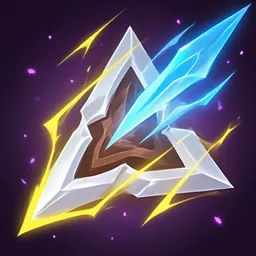 `skill_307` | `reload_up` | Быстрый затвор | Обычный | −12% перезарядка. | 4 | 2 |  | reloadPct -12% |  | нужно: magazine | stat |
| 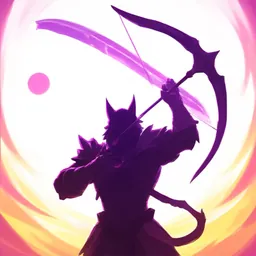 `skill_347` | `range_up` | Удлинённый ствол | Обычный | +10% дальности. | 3 | 2 |  | rangePct +10% |  | нужно: projectile; бонус: long +0.3 | stat |
| 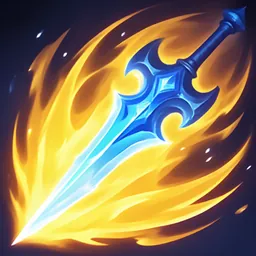 `skill_428` | `proj_speed` | Ускоритель | Обычный | +15% скорости снаряда (реже разбивается о преграды). | 3 | 2 |  | projSpeedPct +15% |  | нужно: projectile; бонус: thrown +0.5, charge +0.4 | stat |
|  `skill_413` | `melee_reach` | Длинный замах | Обычный | +20% радиуса ближнего боя. | 3 | 2 |  | rangePct +20% |  | нужно: melee; бонус: aoe +0.4 | stat |
| 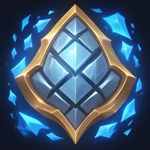 `skill_458` | `armor_up` | Композит | Обычный | +5% снижение урона. | 4 | 2 |  | drPct +5% |  | бонус: block +0.3 | stat |
|  `skill_337` | `lifesteal_small` | Нано-фильтр | Обычный | 3% вампиризм. | 3 | 2 |  |  | `on_hit` → `heal` 3% | бонус: fast +0.3, multi +0.3 | sustain |
|  `skill_388` | `pickup` | Магнит | Обычный | +30% радиус подбора, +10% опыта. | 2 | 1 |  | xpPct +10% |  |  | utility |
|  `skill_316` | `burn_touch` | Термоядро | Необычный | Попадания поджигают. | 1 | 4 |  |  | `on_hit` → `burn` | бонус: fast +0.5, multi +0.6, spread +0.6; штраф: charge -0.3 | onhit |
| 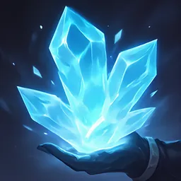 `skill_434` | `frost_touch` | Криокапсула | Необычный | Попадания накладывают обморожение. | 1 | 4 |  |  | `on_hit` → `chill` | бонус: fast +0.6, multi +0.5; штраф: heavy -0.3 | onhit |
| 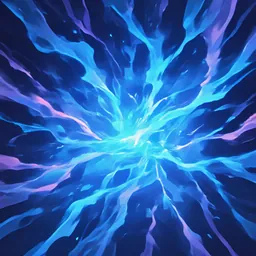 `skill_027` | `static_touch` | Статика | Необычный | Каждое 4-е попадание — молния в ближайшего (30 урона, разряд). | 1 | 4 |  |  | `on_hit` (каждое 4-е) → `chain` (targets 1, dmg 100%) + `shock` + наследует базовые нагрузки | бонус: fast +0.5, sustained +0.5 | onhit |
|  `skill_441` | `heavy_impact` | Ударная масса | Необычный | Попадания отбрасывают, +10% урона по оглушённым. | 2 | 3 |  |  | `on_hit` → `knockback` | бонус: heavy +0.6, stagger +0.5, kinetic +0.5 | onhit |
|  `skill_318` | `void_mark` | Метка пустоты | Необычный | Убийство помечает ближайшего врага в 5 м. | 1 | 3 |  |  | `on_kill` → `pulse` (targets 1, radius 5) + `mark` | бонус: precision +0.4, long +0.3 | onkill |
|  `skill_235` | `nano_regen` | Регенерация | Необычный | Реген 1% HP/с вне боя. | 2 | 3 |  |  | `passive` → `heal` 1% | бонус: long +0.3 | sustain |
| 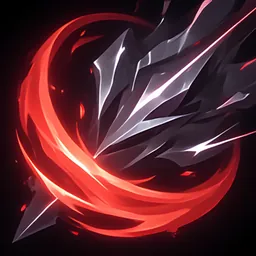 `skill_205` | `crit_dmg` | Бронебойность | Необычный | +30% множитель крита. | 3 | 3 |  | critMultAdd +30% |  | бонус: precision +0.5, charge +0.5 | stat, crit |
| 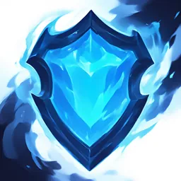 `skill_026` | `second_wind` | Аварийный щит | Необычный | Ниже 30% HP — щит 25% (раз в 40 с). | 1 | 4 |  |  | `on_low_hp` → `shield` 25% | бонус: melee +0.3, close +0.3 | defense |
|  `skill_488` | `quick_hands` | Ловкие руки | Необычный | −25% перезарядка; после неё +15% скорости атаки 3 с. | 1 | 3 |  | reloadPct -25% | `on_reload` → себе: +15% скорости атаки 3 с | нужно: magazine; бонус: sustained +0.4 | reload |
| 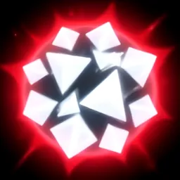 `skill_172` | `glass_cannon` | Стеклянная пушка | Необычный | +25% урона, −15% HP. | 2 | 3 |  | dmgPct +25%, hpPct -15% |  | бонус: long +0.4; штраф: melee -0.3 | stat |
| 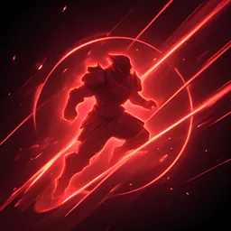 `skill_341` | `momentum` | Инерция | Необычный | +2% урона за метр пробега (макс +30%). | 1 | 3 |  |  | `passive` → себе: урон растёт от движения | бонус: melee +0.6, mobile +0.5; штраф: charge -0.4 | positioning |
| 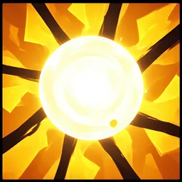 `skill_442` | `charge_speed` | Форсаж | Необычный | +30% скорость зарядки/замаха. | 2 | 3 |  | aspdPct +15% |  | нужен один из: charge, heavy; бонус: charge +0.8, heavy +0.6 | stat |
| 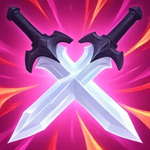 `skill_416` | `backstab` | Фланг | Необычный | +25% урона по целям, которые атакуют не тебя. | 1 | 3 |  |  | `passive` → себе: фланговый бонус | бонус: melee +0.5, silent +0.5 | positioning |
|  `skill_519` | `xp_up` | Нейроускоритель | Необычный | +15% опыта. | 2 | 2 |  | xpPct +15% |  |  | utility |
| 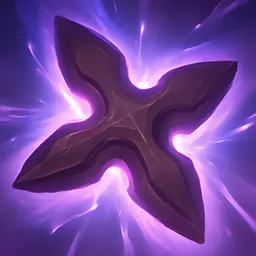 `skill_510` | `ricochet` | Рикошет | Редкий | Снаряды отскакивают к ближайшей цели (−30% урона). | 2 | 5 |  |  | `on_hit` → `ricochet` (count 1, dmg 70%) + наследует базовые нагрузки | нужно: projectile; бонус: ricochet +1, multi +0.6, spread +0.5 | delivery |
| 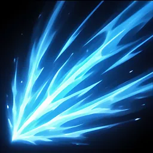 `skill_350` | `pierce` | Пробитие | Редкий | Снаряды пробивают +1 цель. | 2 | 5 |  |  | `on_hit` → `pierce` (count 1, dmg 100%) + наследует базовые нагрузки | нужно: projectile; бонус: pierce +0.8, long +0.5 | delivery |
| 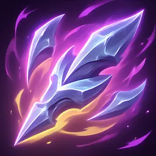 `skill_303` | `multishot` | Мультивыстрел | Редкий | +1 снаряд, −20% урона каждого. | 2 | 5 |  | projectilesAdd +1, dmgPct -20% |  | нужно: projectile; бонус: thrown +0.6, fast +0.4; штраф: spread -0.2 | stat |
|  `skill_044` | `explosive` | Разрывные | Редкий | Попадания взрываются (2 м, 30% урона), взрыв несёт твои статусы. | 1 | 5 |  |  | `on_hit` → `burst` (radius 2, dmg 30%) + наследует базовые нагрузки | нужно: projectile; бонус: charge +0.7, precision +0.5; штраф: multi -0.2 | delivery |
| 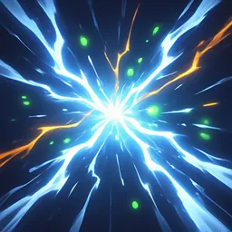 `skill_229` | `chain_lightning` | Цепная молния | Редкий | Все молнии перескакивают ещё на 3 цели. | 1 | 5 |  |  | апгрейд доставки `chain`: targets +3 | бонус: fast +0.4, sustained +0.4 | upgrade |
| 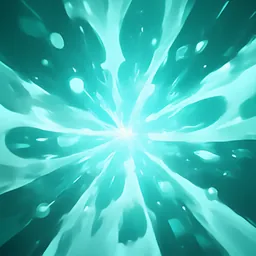 `skill_163` | `shatter` | Дробление | Редкий | Крит по обмороженной цели — ледяной взрыв 4 м на 150%. | 1 | 5 |  |  | `on_crit` по цели с `chill` → `burst` (radius 4, dmg 150%) + `chill` | бонус: precision +0.5, heavy +0.6 | delivery, crit |
|  `skill_197` | `ignite_spread` | Пожар | Редкий | Горящие враги при смерти взрываются огнём (3 м). | 1 | 5 |  |  | `on_kill` по цели с `burn` → `burst` (radius 3, dmg 50%) + `burn` | бонус: multi +0.4, aoe +0.4 | delivery |
| 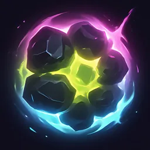 `skill_427` | `gravity_shots` | Гравитация | Редкий | Попадания создают воронку 3 м. | 1 | 5 |  |  | `on_hit` (каждое 3-е) → `pull` (radius 3, dmg 20%) + наследует базовые нагрузки | бонус: charge +0.6, heavy +0.7, aoe +0.6; штраф: fast -0.3 | delivery |
|  `skill_396` | `bleed` | Кровотечение | Редкий | Удары ближнего боя вызывают кровотечение. | 1 | 5 |  |  | `on_hit` → `bleed` | нужно: melee; бонус: fast +0.6, combo +0.6 | onhit |
| 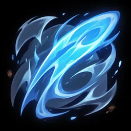 `skill_467` | `whirlwind` | Вихрь | Редкий | Каждый 3-й удар — круговая волна 3 м со всеми статусами. | 1 | 5 |  |  | `on_hit` (каждое 3-е) → `wave` (radius 3, dmg 100%) + наследует базовые нагрузки | нужно: melee; бонус: combo +0.7, heavy +0.5 | delivery |
| 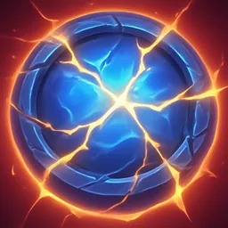 `skill_469` | `shield_wave` | Ударная волна | Редкий | Удар щитом выпускает волну 6 м с отбрасыванием. | 1 | 5 |  |  | `on_hit` → `wave` (radius 6, dmg 60%) + `knockback` + наследует базовые нагрузки | нужно: block; бонус: block +1 | delivery |
|  `skill_296` | `reflect` | Отражение | Редкий | Блок отражает снаряд в стрелка, снаряд несёт твои статусы. | 1 | 5 |  |  | `on_block` → `reflect` (dmg 100%) + наследует базовые нагрузки | нужно: block; бонус: block +1 | delivery, pvp |
|  `skill_407` | `last_round` | Последний патрон | Редкий | Последний патрон в магазине ×3 урона. | 1 | 5 |  |  | `on_reload` → себе: последний патрон ×3 | нужно: magazine; бонус: burst +0.8 | burst |
| 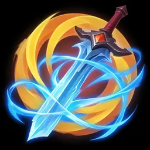 `skill_479` | `homing_plus` | Огибание | Редкий | Снаряд один раз огибает преграду. | 1 | 6 |  |  | `passive` → себе: огибание преграды | нужно: projectile; бонус: thrown +0.6, long +0.5 | utility |
|  `skill_284` | `execute` | Казнь | Редкий | Цели ниже 15% HP умирают от любого попадания. | 1 | 5 |  |  | `on_hit` → `execute` | бонус: fast +0.5, multi +0.5 | onhit |
|  `skill_233` | `vampiric_crit` | Кровавый крит | Редкий | Криты лечат на 8% урона. | 1 | 5 |  |  | `on_crit` → `heal` 8% | бонус: precision +0.5, charge +0.4 | crit, sustain |
| 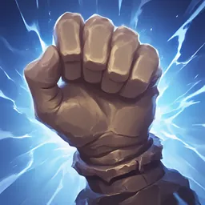 `skill_073` | `kinetic_battery` | Кинетическая батарея | Редкий | 30% полученного/заблокированного урона добавляется к следующей атаке (с отбрасыванием). | 1 | 5 |  |  | `on_block` → `knockback` + себе: копит урон в следующий удар | бонус: block +0.8, heavy +0.6 | defense |
|  `skill_333` | `split_on_kill` | Фрагментация | Эпический | Убийство выпускает 3 осколка (40%) со статусами. | 1 | 7 |  |  | `on_kill` → `split` (count 3, dmg 40%) + наследует базовые нагрузки | нужно: projectile; бонус: multi +0.5, ricochet +0.5 | delivery |
| 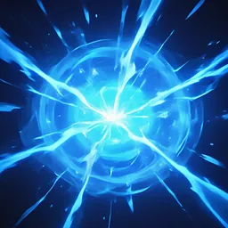 `skill_230` | `storm_core` | Грозовое ядро | Эпический | Каждые 5 с — разряд-волна 8 м. | 1 | 7 |  |  | `periodic` (раз в 5 с) → `wave` (radius 8, dmg 80%) + `shock` | бонус: melee +0.5, close +0.5 | delivery |
| 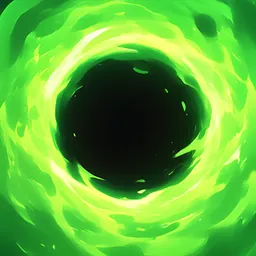 `skill_162` | `black_hole_kill` | Коллапс | Эпический | Каждое 5-е убийство — мини-чёрная дыра 4 м на 2 с. | 1 | 7 |  |  | `on_kill` (каждое 5-е) → `pull` (radius 4, duration 2, dmg 200%) + наследует базовые нагрузки | бонус: aoe +0.5, multi +0.4 | delivery |
| 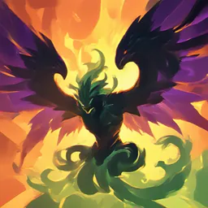 `skill_299` | `phoenix` | Феникс | Эпический | Смерть → огненный взрыв 6 м и возрождение 30% HP. | 1 | 7 |  |  | `on_death` → `burst` (radius 6, dmg 500%) + `burn` `on_death` → `heal` 30% |  | revive |
| 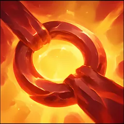 `skill_093` | `infinite_crit` | Бесконечный магазин | Эпический | Криты не тратят патроны и не сбивают комбо. | 1 | 7 |  |  | `passive` → себе: криты бесплатны | нужен один из: magazine, combo; бонус: sustained +0.7, combo +0.6 | crit |
| 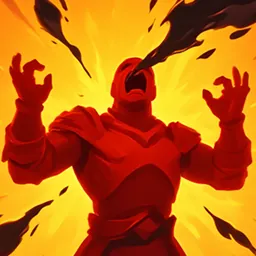 `skill_357` | `adrenaline` | Адреналин | Эпический | Убийство: +5% скорости атаки и бега 4 с (×6). | 1 | 7 |  |  | `on_kill` → себе: ускорение (стак ×6) | бонус: fast +0.5, melee +0.4 | mobility |
|  `skill_390` | `fortress` | Крепость | Эпический | Стоишь 1 с — +40% защиты, +20% урона. | 1 | 7 |  |  | `passive` → себе: бонус за неподвижность | бонус: long +0.7, block +0.5; штраф: mobile -0.4, melee -0.3 | positioning |
| 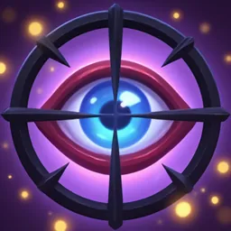 `skill_319` | `hunter_mark` | Охотник | Эпический | Элитники и игроки постоянно помечены и видны сквозь стены. | 1 | 7 |  |  | `passive` → `mark` | бонус: long +0.6, precision +0.5 | pvp |
| 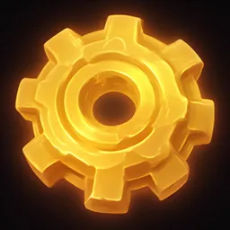 `skill_522` | `overclock` | Оверклок | Эпический | Активные способности −30% кулдаун. | 1 | 7 |  | cdrPct +30% |  |  | cooldown |
| 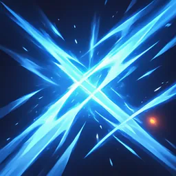 `skill_468` | `twin_blade` | Двойной след | Эпический | Каждый удар повторяется фантомом на 50%. | 1 | 7 |  |  | `on_hit` → `echo` (dmg 50%) + наследует базовые нагрузки | нужно: melee; бонус: fast +0.6, combo +0.6 | delivery |
| 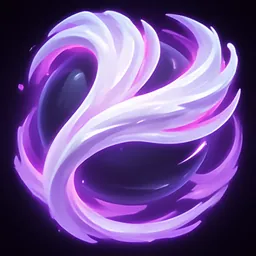 `skill_239` | `echo` | Эхо | Легендарный | Каждая активная способность срабатывает дважды. | 1 | 9 |  |  | триггер `on_activate` ×2 |  | upgrade |
| 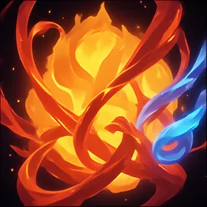 `skill_431` | `omni_element` | Синтез | Легендарный | Все доставки несут все твои статусы (даже те, что не наследуют). | 1 | 9 |  |  | все доставки наследуют базовые нагрузки (`inheritAll`) | бонус: fast +0.5, multi +0.5 | upgrade |
|  `skill_401` | `infinite_ricochet` | Вечный рикошет | Легендарный | Рикошет до 5 целей без потери урона. | 1 | 9 |  |  | `on_hit` → `ricochet` (count 5, dmg 100%) + наследует базовые нагрузки | нужно: projectile; бонус: ricochet +1.2, multi +0.6 | delivery |
| 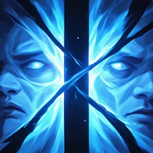 `skill_313` | `mirror_image` | Отражённый | Легендарный | Клон повторяет атаки на 50% и перетягивает автонаводку. | 1 | 9 |  |  | `passive` → `summon` (duration 999, dmg 50%) + наследует базовые нагрузки |  | delivery, pvp |
|  `skill_490` | `deathmark` | Королевская метка | Легендарный | Убийство помеченной цели сбрасывает все кулдауны. | 1 | 9 |  |  | `on_kill` по цели с `mark` → себе: сброс кулдаунов |  | cooldown |
|  `skill_367` | `titan` | Титан | Легендарный | +50% HP, иммунитет к отбрасыванию, АоЕ +40%. | 1 | 9 |  | hpPct +50%, aoeDmgPct +40% |  | бонус: heavy +0.8, aoe +0.6, block +0.4 | defense |

### Активы (14)

| Иконка | id | Название | Редкость | Описание | Стаки | Power | КД | Статы | Эффекты | Совместимость с оружием | Теги |
|---|---|---|---|---|---|---|---|---|---|---|---|
|  `skill_440` | `dash` | Рывок | Необычный | Рывок 6 м, 0.3 с неуязвимости. | 1 | 4 | 8 с |  | `on_activate` → себе: уклонение | бонус: melee +0.6, mobile +0.4 | mobility |
|  `skill_271` | `grenade` | Плазменная граната | Необычный | Взрыв 4 м, 120 урона, поджог. | 1 | 4 | 14 с |  | `on_activate` → `burst` (radius 4, dmg 400%) + `burn` |  | aoe |
| 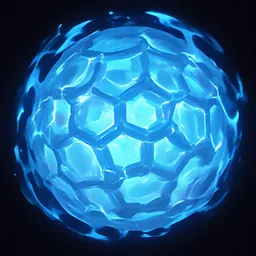 `skill_132` | `barrier` | Барьер | Необычный | Купол 3 м на 4 с, чужие снаряды разрушаются. | 1 | 4 | 22 с |  | `on_activate` → `zone` (radius 3, duration 4) + `shield` | бонус: long +0.5 | defense |
| 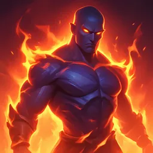 `skill_463` | `overdrive` | Овердрайв | Необычный | +50% скорости атаки 5 с. | 1 | 4 | 20 с |  | `on_activate` → себе: +50% скорости атаки 5 с | бонус: fast +0.4 | buff |
| 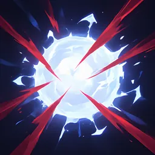 `skill_265` | `shockwave` | Сейсмический удар | Необычный | Отбрасывание всех в 5 м, 80 урона. | 1 | 4 | 12 с |  | `on_activate` → `wave` (radius 5, dmg 250%) + `knockback` | бонус: heavy +0.6 | aoe |
|  `skill_356` | `nano_pulse` | Нано-импульс | Необычный | Лечение 30% HP. | 1 | 4 | 25 с |  | `on_activate` → `heal` 30% |  | heal |
| 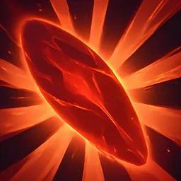 `skill_505` | `blink` | Блинк | Редкий | Телепорт 8 м сквозь преграды. | 1 | 5 | 12 с |  | `on_activate` → себе: телепорт | бонус: melee +0.5, silent +0.4 | mobility |
| 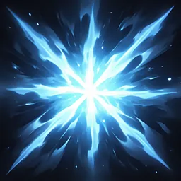 `skill_274` | `cryo_burst` | Криовзрыв | Редкий | Заморозка всех в 5 м на 2 с. | 1 | 5 | 18 с |  | `on_activate` → `wave` (radius 5) + `chill` ×5 | бонус: melee +0.6, heavy +0.5 | cc |
| 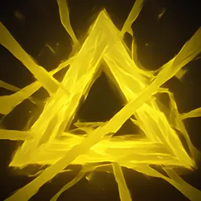 `skill_126` | `volt_trap` | Вольт-ловушка | Редкий | Ловушка: оглушение и 150 урона. | 1 | 5 | 16 с |  | `on_activate` → `trap` (radius 2, dmg 500%) + `shock` | бонус: long +0.4 | trap |
|  `skill_312` | `decoy` | Приманка | Редкий | Голограмма 6 с: автонаводка переключается на неё. | 1 | 5 | 20 с |  | `on_activate` → `summon` (duration 6, dmg 0%) | бонус: silent +0.4 | pvp |
| 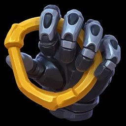 `skill_290` | `grapple` | Гарпун | Редкий | Притягивает врага к тебе (или тебя к нему). | 1 | 5 | 12 с |  | `on_activate` → `pull` (targets 1, radius 12) | бонус: melee +0.8 | mobility |
|  `skill_047` | `smoke` | Дымовая завеса | Редкий | Облако 6 м на 5 с: автонаводка внутри не работает. | 1 | 5 | 18 с |  | `on_activate` → `zone` (radius 6, duration 5, dmg 0%) | бонус: melee +0.6 | pvp |
| 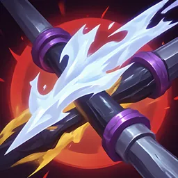 `skill_369` | `turret` | Турель | Эпический | Турель 10 с, стреляет твоими статусами. | 1 | 6 | 30 с |  | `on_activate` → `summon` (duration 10, dmg 80%) + наследует базовые нагрузки |  | summon |
|  `skill_397` | `salvo` | Залп | Эпический | 3 с каждая атака ×3 снаряда. | 1 | 6 | 24 с |  | `on_activate` → себе: ×3 снаряда 3 с | нужно: projectile; бонус: multi +0.5 | burst |

### Ультимейты (7)

| Иконка | id | Название | Редкость | Описание | Стаки | Power | Заряд | Статы | Эффекты | Совместимость с оружием | Теги |
|---|---|---|---|---|---|---|---|---|---|---|---|
|  `skill_214` | `orbital` | Орбитальный удар | Легендарный | Удар 10 м: 1500 урона, поджог. | 1 | 10 | Нанести 3000 урона, не получив урона. |  | `on_ult` → `burst` (radius 10, dmg 4000%) + `burn` | бонус: long +0.5 | aoe |
| 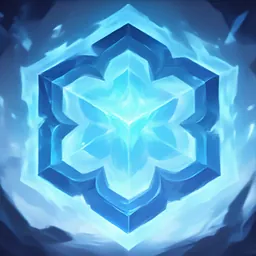 `skill_111` | `time_stop` | Стазис-поле | Легендарный | Все в 15 м заморожены на 4 с. | 1 | 10 | 10 уклонений/блоков подряд. |  | `on_ult` → `wave` (radius 15) + `chill` ×5 | бонус: block +0.6 | cc |
|  `skill_501` | `thunder_god` | Громовержец | Легендарный | 8 с каждое попадание — цепная молния на 5 целей. | 1 | 10 | 50 попаданий молниями. |  | `on_hit` [окно ульты 8 с] → `chain` (targets 5, dmg 100%) + `shock` + наследует базовые нагрузки | бонус: fast +0.6 | chain |
|  `skill_164` | `singularity` | Сингулярность | Легендарный | Чёрная дыра 8 м 4 с, затем взрыв 1000. | 1 | 10 | 5 убийств помеченных целей. |  | `on_ult` → `pull` (radius 8, duration 4, dmg 2500%) + наследует базовые нагрузки |  | aoe |
|  `skill_464` | `juggernaut` | Джаггернаут | Легендарный | 8 с неуязвимость, каждый шаг — волна отбрасывания. | 1 | 10 | Поглотить 500 урона щитом/бронёй. |  | `on_ult` → `wave` (radius 3, duration 8, dmg 100%, повтор 0.5 с) + `knockback` | бонус: block +0.8, heavy +0.6 | defense |
| 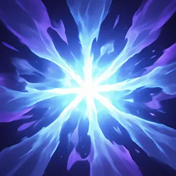 `skill_224` | `overheal_nova` | Нова | Легендарный | Полное лечение, оверхил — взрыв 8 м. | 1 | 10 | Восстановить 400 HP. |  | `on_ult` → `heal` 100% `on_ult` → `burst` (radius 8, dmg 1000%) |  | heal |
|  `skill_435` | `ghost_protocol` | Протокол-призрак | Легендарный | 6 с невидимости, крит 100%. | 1 | 10 | Убить элитника, не получив урона. |  | `on_ult` → себе: невидимость + крит 100% | бонус: silent +0.8 | pvp |

## Модули оружия

Слоты: `core` = Ядро, `barrel` = Излучатель, `frame` = Каркас. Ставятся до катки, в конструкторе участвуют как моды (наследуются, реагируют, попадают в авто-имена).

### Ядро (`core`, 7)

| id | Название | Редкость | Описание | Power | Статы | Эффекты | Совместимость |
|---|---|---|---|---|---|---|---|
| `core_plasma` | Плазменное ядро | Необычный | Каждое 2-е попадание поджигает. | 3 |  | `on_hit` (каждое 2-е) → `burn` | бонус: fast +0.4, multi +0.4 |
| `core_cryo` | Крио-ядро | Необычный | Каждое 2-е попадание — обморожение. | 3 |  | `on_hit` (каждое 2-е) → `chill` | бонус: fast +0.4, multi +0.4 |
| `core_volt` | Вольт-ядро | Необычный | Каждое 6-е попадание — молния с разрядом в ближайшего. | 3 |  | `on_hit` (каждое 6-е) → `chain` (targets 1, dmg 60%) + `shock` + наследует базовые нагрузки | бонус: sustained +0.4 |
| `core_void` | Пустотное ядро | Необычный | Убийство помечает ближайшего врага. | 3 |  | `on_kill` → `pulse` (targets 1, radius 6) + `mark` | бонус: precision +0.4 |
| `core_kinetic` | Кинетическое ядро | Необычный | Каждое 3-е попадание отбрасывает. | 3 |  | `on_hit` (каждое 3-е) → `knockback` | бонус: heavy +0.5, stagger +0.4 |
| `core_nano` | Нано-ядро | Необычный | 2% вампиризм. | 3 |  | `on_hit` → `heal` 2% |  |
| `core_omni` | Резонансное ядро | Легендарный | Все статусы накладываются в 2 стака. | 8 | dmgPct +5% | `passive` → себе: все статусы ×2 стака |  |

### Излучатель (`barrel`, 9)

| id | Название | Редкость | Описание | Power | Статы | Эффекты | Совместимость |
|---|---|---|---|---|---|---|---|
| `barrel_ricochet` | Рикошетный излучатель | Редкий | Снаряд 1 раз отскакивает (−40% урона), несёт статусы. | 4 |  | `on_hit` → `ricochet` (count 1, dmg 60%) + наследует базовые нагрузки | нужно: projectile; бонус: thrown +0.6, spread +0.4 |
| `barrel_split` | Расщепитель | Редкий | +1 снаряд, −15% урона каждого. | 4 | projectilesAdd +1, dmgPct -15% |  | нужно: projectile; бонус: fast +0.4 |
| `barrel_pierce` | Пробойник | Редкий | Снаряд пробивает +1 цель. | 4 |  | `on_hit` → `pierce` (count 1, dmg 80%) + наследует базовые нагрузки | нужно: projectile; бонус: long +0.5, charge +0.4 |
| `barrel_burst` | Разрывной излучатель | Редкий | Каждое 4-е попадание — взрыв 1.5 м (20%) со статусами. | 4 |  | `on_hit` (каждое 4-е) → `burst` (radius 1.5, dmg 20%) + наследует базовые нагрузки | нужно: projectile; бонус: charge +0.6, precision +0.4 |
| `barrel_phantom` | Фантомное лезвие | Редкий | Каждый 4-й удар повторяется фантомом (40%). | 4 |  | `on_hit` (каждое 4-е) → `echo` (dmg 40%) + наследует базовые нагрузки | нужно: melee; бонус: combo +0.5 |
| `barrel_shockwave` | Ударный излучатель | Редкий | Каждый 5-й удар — волна 3 м (50%) со статусами. | 4 |  | `on_hit` (каждое 5-е) → `wave` (radius 3, dmg 50%) + наследует базовые нагрузки | нужно: melee; бонус: heavy +0.6, aoe +0.4 |
| `barrel_choke` | Чок | Редкий | Разброс уже: +40% дальности и оптимума, −1 снаряд. | 4 | rangePct +40%, projectilesAdd -1 |  | нужно: spread |
| `barrel_gravity` | Гравитационный излучатель | Эпический | Крит создаёт воронку 2 м. | 5 |  | `on_crit` → `pull` (radius 2, dmg 20%) + наследует базовые нагрузки | бонус: precision +0.5, heavy +0.5 |
| `barrel_resonator` | Резонатор | Эпический | Все молнии: +1 цель. | 5 |  | апгрейд доставки `chain`: targets +1 |  |

### Каркас (`frame`, 10)

| id | Название | Редкость | Описание | Power | Статы | Эффекты | Совместимость |
|---|---|---|---|---|---|---|---|
| `frame_light` | Лёгкий каркас | Обычный | +10% скорости атаки, +5% бега. | 2 | aspdPct +10%, speedPct +5% |  | бонус: fast +0.3, mobile +0.3 |
| `frame_heavy` | Тяжёлый каркас | Обычный | +15% урона, −5% мобильности. | 2 | dmgPct +15% |  | бонус: heavy +0.4, charge +0.3 |
| `frame_stabilizer` | Стабилизатор | Необычный | +10% крита. | 3 | critPct +10% |  | бонус: precision +0.5 |
| `frame_mag` | Расширенный магазин | Необычный | −30% перезарядка. | 3 | reloadPct -30% |  | нужно: magazine |
| `frame_longbarrel` | Удлинённый ствол | Необычный | +25% дальности, спад на максимуме мягче. | 3 | rangePct +25%, falloffAdd +15% |  | нужно: projectile; бонус: long +0.5, precision +0.3 |
| `frame_reach` | Телескопическая рукоять | Необычный | +35% радиуса ближнего боя. | 3 | rangePct +35% |  | нужно: melee; бонус: heavy +0.4, aoe +0.4 |
| `frame_compensator` | Компенсатор | Редкий | Убирает штраф в упор: минимальная дистанция −8 м. | 4 | rangeMinAdd -8, closeMultAdd +40% |  | нужен один из: charge, long; бонус: long +0.6, charge +0.6 |
| `frame_reactive` | Реактивная пластина | Редкий | Блок даёт щит 5% HP. | 4 |  | `on_block` → `shield` 5% | нужно: block |
| `frame_homing` | Огибающий каркас | Эпический | Снаряд огибает преграду 1 раз. | 5 |  | `passive` → себе: огибание преграды | нужно: projectile; бонус: thrown +0.5, long +0.4 |
| `frame_scope` | Прицельный модуль | Эпический | Оптимальная дистанция +30%, крит +5%, но −10% скорости атаки. | 5 | rangeOptPct +30%, critPct +5%, aspdPct -10% |  | нужно: projectile; бонус: long +0.5, precision +0.5 |

## Предметы (items)

Подбираются на карте, 1 слот, срабатывают по `on_use`.

| id | Название | Категория | Редкость | Зарядов | Power | Описание | Эффекты |
|---|---|---|---|---|---|---|---|
| `it_cryo_grenade` | Криогранаты | боевой | Необычный | 2 | 4 | Заморозка всех в 5 м на 2 с. | `on_use` → `wave` (radius 5) + `chill` ×5 |
| `it_thermite` | Термитная шашка | боевой | Необычный | 2 | 4 | Горящая зона 3 м на 6 с. | `on_use` → `zone` (radius 3, duration 6, dmg 50%) + `burn` |
| `it_emp` | ЭМИ-граната | PvP | Редкий | 1 | 6 | Разряд 6 м; у всех в радиусе (и игроков) отключена автонаводка на 3 с. | `on_use` → `burst` (radius 6, dmg 100%) + `shock` + себе: автонаводка врагов отключена 3 с |
| `it_gravity_mine` | Гравитационная мина | боевой | Редкий | 1 | 5 | Мина: при срабатывании стягивает всех в 4 м на 2 с. | `on_use` → `trap` (radius 4, duration 2, dmg 150%) |
| `it_resonance` | Резонансный заряд | боевой | Эпический | 1 | 8 | Взрыв 5 м, несёт ВСЕ твои статусы — одна кнопка запускает все реакции билда. | `on_use` → `burst` (radius 5, dmg 300%) + наследует базовые нагрузки |
| `it_medkit` | Аптечка | выживание | Обычный | 1 | 3 | Лечение 50% HP за 3 с. | `on_use` → `heal` 50% |
| `it_nanoshield` | Нано-щит | выживание | Необычный | 1 | 4 | Щит 30% HP на 10 с. | `on_use` → `shield` 30% |
| `it_smoke` | Дымовая шашка | PvP | Обычный | 2 | 3 | Облако 5 м на 5 с: автонаводка внутри не работает ни у кого. | `on_use` → `zone` (radius 5, duration 5, dmg 0%) |
| `it_hologram` | Голограмма | PvP | Редкий | 1 | 5 | Копия тебя на 8 с, автонаводка врагов и игроков переключается на неё. | `on_use` → `summon` (duration 8, dmg 0%) |
| `it_stim` | Стимулятор | боевой | Необычный | 1 | 4 | +30% скорости атаки и бега на 8 с. | `on_use` → себе: +30% скорости атаки и бега 8 с |
| `it_radar` | Радар-пульсар | информация | Необычный | 2 | 4 | Показывает элитников, игроков и артефакты в 80 м на 10 с. | `on_use` → себе: разведка 80 м |
| `it_evac_beacon` | Маяк эвакуации | экономика | Редкий | 1 | 6 | Вызывает точку эвакуации рядом (60 с ожидания, видно всем). | `on_use` → себе: точка эвакуации здесь через 60 с |
| `it_reroll_token` | Жетон реролла | экономика | Редкий | 1 | 5 | Бесплатный реролл слота у автомата (редкость слота сохраняется). | `on_use` → себе: реролл без артефакта |
| `it_xp_booster` | Нейробустер | экономика | Необычный | 1 | 4 | +1 уровень мгновенно. | `on_use` → себе: +1 уровень |
| `it_artifact_scanner` | Сканер артефактов | информация | Необычный | 1 | 3 | Подсвечивает артефакты rare+ в 150 м на 20 с. | `on_use` → себе: скан артефактов 150 м |
| `it_ult_charge` | Ядро-ускоритель | боевой | Эпический | 1 | 7 | Ульта заряжена мгновенно. | `on_use` → себе: заряд ульты 100% |
| `it_overload` | Перегрузка | боевой | Эпический | 1 | 7 | 10 с все активные способности без кулдауна. | `on_use` → себе: кулдауны активок 0 на 10 с |

## VFX-примитивы (Unity VFX Graph)

| Примитив | Unity subgraph | Точка привязки | Свойства | Описание |
|---|---|---|---|---|
| `Trail` | VFX_Trail | Projectile | ColorA, ColorB, Width | след снаряда, тонируется элементами |
| `TrailMulti` | VFX_Trail ×N | Projectile | ColorA, ColorB, Width | следы дробин |
| `TrailReturn` | VFX_Trail (loop) | Projectile | ColorA, ColorB | след туда-обратно |
| `ChargeGlow` | VFX_Charge | Muzzle | ColorA, Charge01 | накопление на луке |
| `Slash` | VFX_Slash | WeaponTip | ColorA, Length | росчерк клинка |
| `SlashArc` | VFX_Slash (arc) | WeaponTip | ColorA, Angle | дуга замаха 120° |
| `ShieldFlash` | VFX_ShieldFlash | Shield | ColorA | вспышка блока |
| `Impact` | VFX_Impact | HitPoint | ColorA, Size | вспышка попадания |
| `ImpactHeavy` | VFX_Impact (heavy) | HitPoint | ColorA, Size | тяжёлый удар с пылью |
| `Arc` | VFX_Arc | Target→Target | ColorA, ColorB, Jitter | дуга между двумя точками |
| `Redirect` | VFX_Redirect | HitPoint | ColorA | излом траектории + искры |
| `Burst` | VFX_Burst | HitPoint | ColorA, ColorB, Radius | сферический взрыв |
| `Zone` | VFX_Zone | Ground | ColorA, Radius, Duration | декаль + частицы на земле |
| `Vortex` | VFX_Vortex | Point | ColorA, Radius, Duration | частицы внутрь |
| `Ring` | VFX_Ring | Player | ColorA, Radius | расширяющееся кольцо |
| `Pulse` | VFX_Pulse | Point | ColorA, Radius | кольцо-импульс без урона |
| `Ghost` | VFX_Ghost | Player | ColorA, Alpha | полупрозрачный дубль удара |
| `Summon` | VFX_Summon | Ground | ColorA | материализация сущности |
| `Trap` | VFX_Trap | Ground | ColorA, Radius | маркер ловушки |
| `Orbit` | VFX_Orbit | Player | ColorA, Count, Radius | орбитальные снаряды |
| `StatusAura` | VFX_StatusAura | Target | ColorA, Stacks | аура статуса на цели (цвет = элемент) |
| `SelfPulse` | VFX_SelfPulse | Player | ColorA | импульс на игроке (лечение/щит) |
| `Shatter` | VFX_Shatter | Target | ColorA, Radius | разлёт ледяных осколков |
| `Steam` | VFX_Steam | Target | Radius | пар от термошока |
| `EmberTrail` | VFX_Ember | Path | ColorA | искры/угли по пути |
| `HeatHaze` | VFX_HeatHaze | Target | Radius | марево |
| `FrostSpark` | VFX_FrostSpark | Target | ColorA | искры по льду |
| `FreezeShell` | VFX_FreezeShell | Target | ColorA | ледяная корка |

## Мета-прогрессия

### Принципы

- Мета — горизонталь: шире пул, больше опций. Вертикаль ≤ +15% на максимуме.
- Артефакт — главный конфликт катки: реролл сейчас или эссенция в мету.
- Выдача модов (зафиксировано): 1) оружие + модуль формируют пул — несовместимое не падает, совместимое весит больше; 2) умный драфт — после первого оффера веса смещаются к модам, дающим новую реакцию или композит с тем, что уже есть; 3) превью в оффере — «станет Огненной молнией, откроет Плазменную дугу»; 4) пики на уровнях 5/10/14 — три мода на редкость выше; 5) бан-жетоны с карты — убрать мод из своих офферов до конца катки. Пул до катки НЕ курируется: лаборатория только открывает моды в общий пул.
- Ульта-слот открывается в мете за ядро босса.
- Слоты в катке: 5 пассивок + 3 актива + 1 ульта = 9 выборов → к 10-му уровню билд собран, на 10-м оффер целиком из ульт. Мало слотов = мало одновременных статусов = читаемый VFX; вау-эффект достигается глубиной (наследование, реакции), а не количеством.
- Предметы: 1 слот, подбираются на карте, не сохраняются между катками. Это «джокер» катки: боевые (заморозка, резонансный заряд со всеми статусами билда), выживание, информация (радар, сканер артефактов), экономика (маяк эвакуации, жетон реролла, +1 уровень), PvP (ЭМИ, дым, голограмма — все ломают автонаводку).
- Тиры оружия T1–T5: +3% за тир и черта на T3/T5.
- Модули оружия — мета-слой синергии: ядро (статус), излучатель (доставка), каркас (статы). Слоты открываются тирами: T1 — ядро, T3 — излучатель, T5 — каркас. Модуль выбирается до катки и задаёт стартовый элемент билда — игрок драфтит моды под него.

### Валюты

| id | Название | Источник | Куда тратится |
|---|---|---|---|
| `scrap` | Лом | Обычный лут, ящики, караваны. | Уровни зданий, тиры оружия. |
| `essence` | Эссенция | Вывезенные артефакты (по редкости). | Исследования модов в Лаборатории. |
| `core` | Ядро босса | Главный босс. | Ульта-слот, T5, уникальные постройки. |
| `blueprint` | Чертёж | Элитники, караваны. | Открытие оружия. |

### Постройки

**Мастерская** (`workshop`) — Открытие и прокачка оружия.

| Ур. | Стоимость | Открывает |
|---|---|---|
| 1 | 0 scrap | Пистолет и Клинок. Тир до T2. |
| 2 | 800 scrap | Оружие по чертежам (Сюрикен, Щит, Пушка). T3. |
| 3 | 2500 scrap, 100 essence | Лук, Винтовка, Бита. T4. |
| 4 | 6000 scrap, 400 essence, 1 core | T5 + вторая черта. |

**Лаборатория** (`lab`) — Открытия: исследованный мод навсегда добавляется в общий пул катки. Кураторства нет — сюрприз сохраняется.

| Ур. | Стоимость | Открывает |
|---|---|---|
| 1 | 0 scrap | Стартовый пул: все common + 6 uncommon. 1 исследование за раз. |
| 2 | 1200 scrap, 80 essence | Исследования rare. Стартовый common-мод на выбор при высадке. |
| 3 | 3000 scrap, 300 essence | Исследования epic. 2 параллельных исследования. |
| 4 | 7000 scrap, 900 essence, 1 core | Исследования legendary и ульт (только за ядра босса). |

**Хранилище** (`vault`) — Артефакты и конверсия.

| Ур. | Стоимость | Открывает |
|---|---|---|
| 1 | 0 scrap | 20 артефактов. Конверсия ×1.0. |
| 2 | 1500 scrap | 60. Страховка 1 артефакта при смерти. |
| 3 | 4000 scrap, 250 essence | ×1.25. 1 артефакт можно брать в катку. |

**Медблок** (`medbay`) — Малая вертикаль живучести.

| Ур. | Стоимость | Открывает |
|---|---|---|
| 1 | 600 scrap | +5% HP. |
| 2 | 2000 scrap, 100 essence | +10% HP, реген вне боя. |
| 3 | 5000 scrap, 300 essence | +15% HP, 1 аварийный щит. |

**Радар** (`radar`) — Информация об острове.

| Ур. | Стоимость | Открывает |
|---|---|---|
| 1 | 900 scrap | Точки эвакуации с начала. |
| 2 | 2500 scrap, 150 essence | Караваны и таймер элитников. |
| 3 | 6000 scrap, 500 essence | Босс и пинг игроков рядом. |

**Ангар** (`hangar`) — Эвакуация.

| Ур. | Стоимость | Открывает |
|---|---|---|
| 1 | 1000 scrap | Эвакуация −20% времени. |
| 2 | 3500 scrap, 200 essence | Доп. точка эвакуации. |
| 3 | 8000 scrap, 600 essence, 2 core | Экстренная эвакуация 1/катку. |

**Реактор** (`reactor`) — Ульта-слот.

| Ур. | Стоимость | Открывает |
|---|---|---|
| 1 | 3000 scrap, 300 essence, 1 core | Слот ультимейта. |
| 2 | 8000 scrap, 1000 essence, 3 core | Условие заряда −25%. |

### Тиры оружия

| Тир | Стоимость | Бонус |
|---|---|---|
| T1 | 0 scrap | База. |
| T2 | 500 scrap | +3%. |
| T3 | 1500 scrap, 60 essence | +6%, первая черта. |
| T4 | 4000 scrap, 200 essence | +9%. |
| T5 | 9000 scrap, 600 essence, 1 core | +12%, вторая черта. |

### Петля катки

| Фаза | Минуты | Что происходит |
|---|---|---|
| Высадка | 0–1 | Все на уровне 1, стартовое оружие из меты. |
| Лут и фарм | 1–6 | Обычные враги, common/uncommon артефакты, уровни 1–5. |
| Элитники | 6–11 | Rare/epic артефакты, чертежи, уровни 6–10. Первые PvP-стычки. |
| Караваны | 9–14 | Караваны по маршрутам — точка конфликта игроков. |
| Босс | 13–18 | Главный босс в центре. Ядро, legendary артефакт. Пик билдов. |
| Эвакуация | 15–20 | Бег к точке с лутом. |

